# BearMemori Architecture

## Overview

BearMemori is a personal memory management system built as a set of microservices. Users capture memories, tasks, reminders, and events via Telegram. An LLM processes items asynchronously (image tagging, intent classification, event extraction). All LLM-generated content starts as `pending` -- the user must confirm before it becomes `confirmed`.

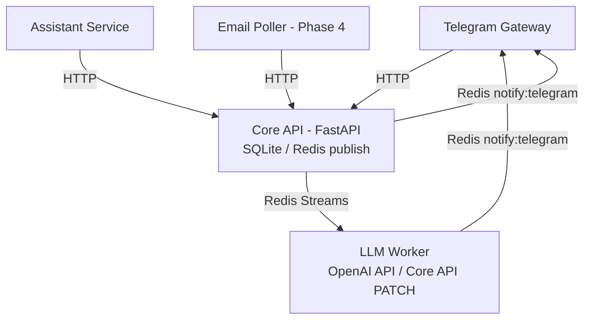

---

## Key Architectural Decisions

### 1. Core API as Single Source of Truth

All services read from and write to the Core API over HTTP. No service accesses SQLite directly except Core. This keeps data integrity centralized and allows services to evolve independently.

### 2. SQLite with WAL Mode

SQLite was chosen for simplicity (single-user system, no need for a full database server). WAL (Write-Ahead Logging) mode enables concurrent reads while writes are in progress. Foreign keys are enforced at the connection level.

### 3. Redis Streams for Async Job Queuing

Inter-service communication uses Redis Streams with consumer groups. This provides:
- Reliable delivery (messages persist until acknowledged)
- Consumer groups prevent duplicate processing
- Decoupled producers and consumers (Core publishes, LLM Worker consumes)

### 4. Pending-by-Default for LLM Output

All LLM-generated content (tags, intent classifications, extracted events) starts with `pending` status. Users must explicitly confirm before it becomes `confirmed`. This prevents LLM hallucinations from silently corrupting user data.

### 5. Two Separate Telegram Bots

The Telegram Gateway and Assistant Service each run their own bot with a separate token. The gateway handles structured interactions (commands, keyboards, conversation flows). The assistant handles free-form conversation via OpenAI tool-calling.

### 6. Token-Aware Context Management

The Assistant Service tracks token usage with `tiktoken` and automatically summarizes chat history when it exceeds 70% of the available budget. This prevents context window overflow while preserving conversation continuity.

---

## Services

### Core API (`core/core_svc/`)

FastAPI application on port 8000. Manages all domain entities via REST endpoints.

- **Database:** SQLite with aiosqlite, WAL mode, foreign keys enabled
- **Migrations:** Numbered SQL files in `core/migrations/`, applied automatically on startup via `PRAGMA user_version`
- **Audit log:** Every mutation logs entity type, entity ID, action, actor, and optional detail JSON
- **FTS5 search:** Full-text search on memory content and confirmed tags, with stop-word filtering and pin boosting

**Background scheduler** (30-second interval):
1. Fire due reminders and handle recurrence
2. Expire pending memories past their 7-day window
3. Expire suggested tags older than 7 days
4. Re-queue stale pending events (pending > 24 hours)

Each scheduler task is independently error-handled -- one failure does not cascade to others.

### Telegram Gateway (`telegram/tg_gateway/`)

Primary user interface. Receives text and photo messages, manages multi-step conversation flows, and renders inline keyboards.

- **Commands:** `/help`, `/find`, `/tasks`, `/pinned`, `/cancel`
- **Photo handling:** Downloads image, creates pending memory (7-day expiry), queues LLM tagging job
- **Text handling:** Checks for pending conversation state, otherwise queues for LLM intent classification
- **Callback handling:** 9 callback types for interactive keyboards (memory actions, due dates, reminders, tags, intents, search, tasks, delete confirmation, reschedule)
- **Redis consumer:** Listens on `notify:telegram` for LLM results, reminders, and event notifications

### LLM Worker (`llm_worker/worker/`)

Async job processor. Consumes from 5 Redis streams, calls the OpenAI API, persists results to Core API.

**Handlers:**

| Handler | Stream | Purpose |
|---|---|---|
| ImageTagHandler | `llm:image_tag` | Vision model extracts description + tags from images |
| IntentHandler | `llm:intent` | Classifies user message intent (reminder, task, search, note, ambiguous) |
| FollowupHandler | `llm:followup` | Generates clarifying question for ambiguous input |
| TaskMatchHandler | `llm:task_match` | Matches memory content against open tasks (confidence > 0.7) |
| EmailExtractHandler | `llm:email_extract` | Extracts calendar events from email content (confidence > 0.7) |

### Assistant Service (`assistant/assistant_svc/`)

Conversational AI agent using OpenAI tool-calling. Runs a separate Telegram bot.

- **7 tools:** search_memories, get_memory, list_tasks, create_task, list_reminders, create_reminder, list_events
- **Briefing:** Pre-loads upcoming tasks, unfired reminders, and previous session summary into system prompt
- **Daily digest:** Checks every 15 minutes, sends once per user per day at configured hour (respects user timezone)
- **Context management:** Token-counted chat history in Redis (24h TTL), session summaries (7-day TTL)

### Shared Library (`shared/shared_lib/`)

Foundational dependency installed by all other services. Contains no business logic.

- **config.py** -- `Settings` class via Pydantic Settings, `load_config()` function
- **enums.py** -- 9 domain enums (MemoryStatus, TaskState, JobType, etc.)
- **schemas.py** -- 30+ Pydantic models for all API contracts
- **redis_streams.py** -- `publish()`, `consume()`, `ack()`, `create_consumer_group()`, stream/group constants

### Email Poller (`email_poller/poller/`) -- Phase 4

Stub service. When implemented, will poll IMAP accounts, filter/deduplicate emails, and submit to Core API for LLM event extraction.

---

## Message Flow

### Memory Creation (Text)

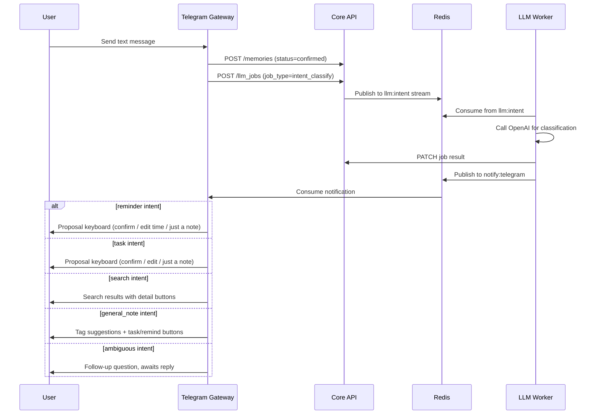

### Memory Creation (Image)

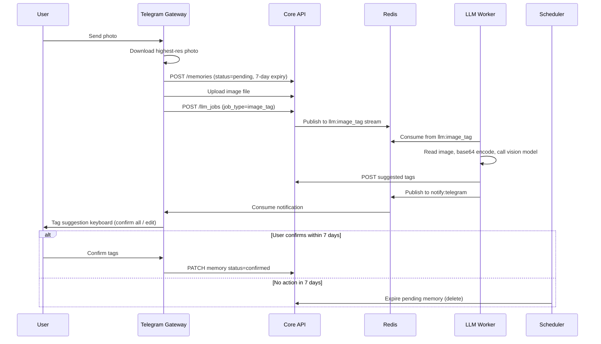

### Reminder Firing

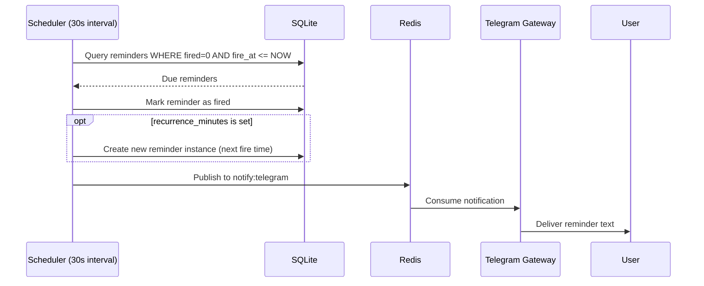

### Event Confirmation

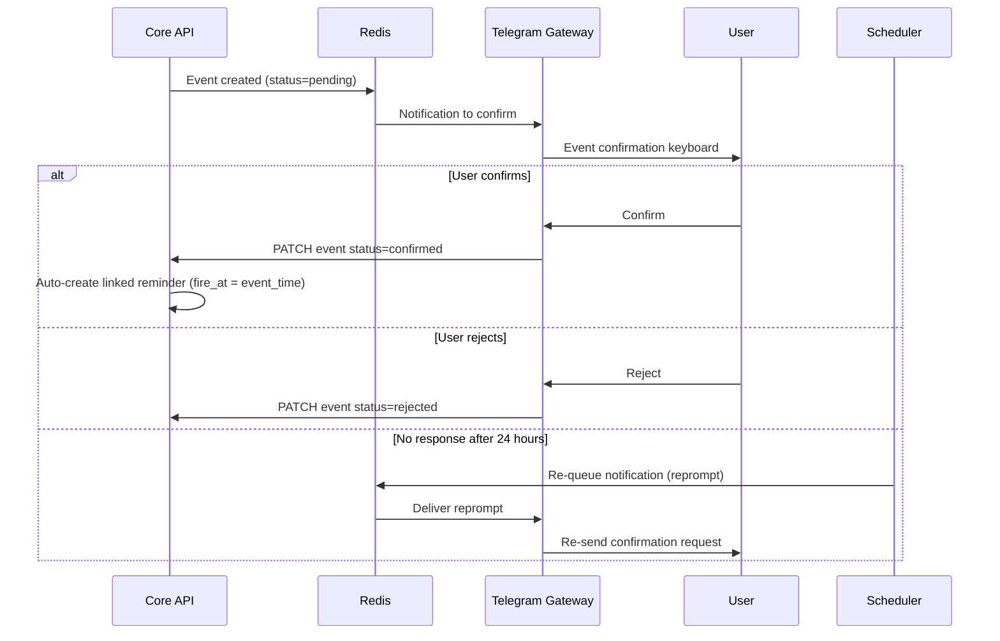

### Assistant Conversation

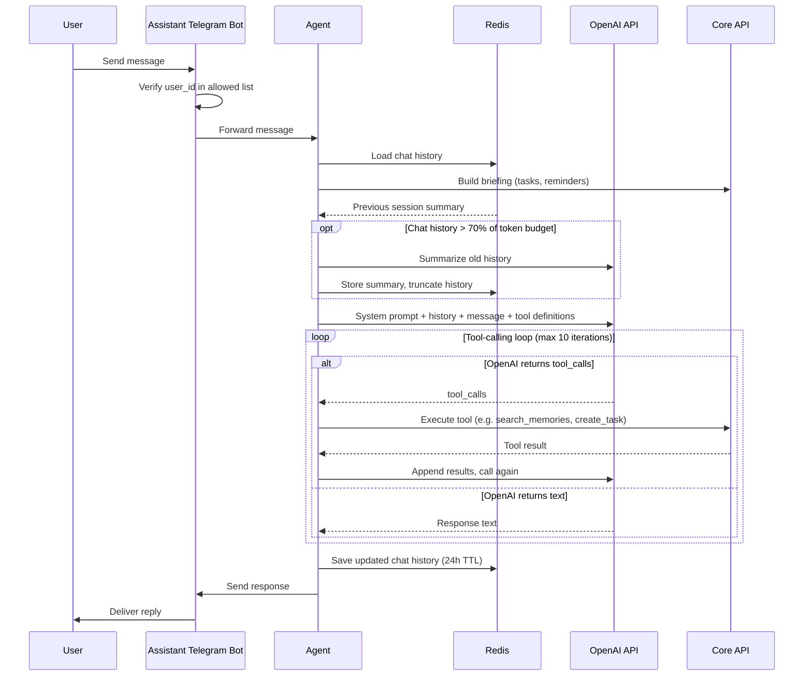

---

## Error Handling

### LLM Worker Retry Strategy

The worker classifies failures into two categories with distinct retry strategies:

**Invalid Response** (parsing errors, missing fields, logic bugs):
- Exponential backoff: 1s, 2s, 4s, 8s, 16s (capped)
- Max 5 attempts
- After exhaustion: mark job as `failed`, publish `llm_failure` notification, acknowledge message

**Unavailable** (connection errors, timeouts, HTTP 5xx):
- No backoff delay (retried on next consumer cycle)
- Sets `queue_paused` flag until service recovers
- Retries continuously for up to 14 days
- First occurrence: publishes `llm_failure` notification
- After 14 days: mark as `failed`, publish `llm_expiry` notification

**Failure classification:**

| Exception | Classification |
|---|---|
| LLMTimeoutError, asyncio.TimeoutError | UNAVAILABLE |
| ConnectionRefusedError, ConnectionError, OSError | UNAVAILABLE |
| HTTP status >= 500 | UNAVAILABLE |
| json.JSONDecodeError | INVALID_RESPONSE |
| ValueError (missing fields) | INVALID_RESPONSE |
| All other exceptions | INVALID_RESPONSE (default) |

### Message Staleness

The LLM Worker skips messages older than **5 minutes** (parsed from the Redis stream message ID timestamp). This prevents processing outdated jobs after worker restarts. Stale messages are acknowledged and discarded.

### Telegram Flood Control

The gateway consumer applies a **1-second delay** between consecutive messages to the same user. This prevents hitting Telegram's rate limits when multiple notifications arrive in quick succession.

### Core API Health Check

Docker Compose uses `curl -f http://localhost:8000/health` with:
- Interval: 30 seconds
- Timeout: 5 seconds
- Retries: 3
- Start period: 10 seconds

All dependent services wait for `service_healthy` before starting.

### Assistant Error Handling

- Core API connection errors raise `CoreUnavailableError`
- 404 responses raise `CoreNotFoundError`
- Tool execution errors are returned as error dicts to OpenAI (the model decides how to communicate the failure to the user)
- Token budget overflow prevented by automatic summarization at 70% threshold

---

## Data Lifecycle

### Memory Status Flow

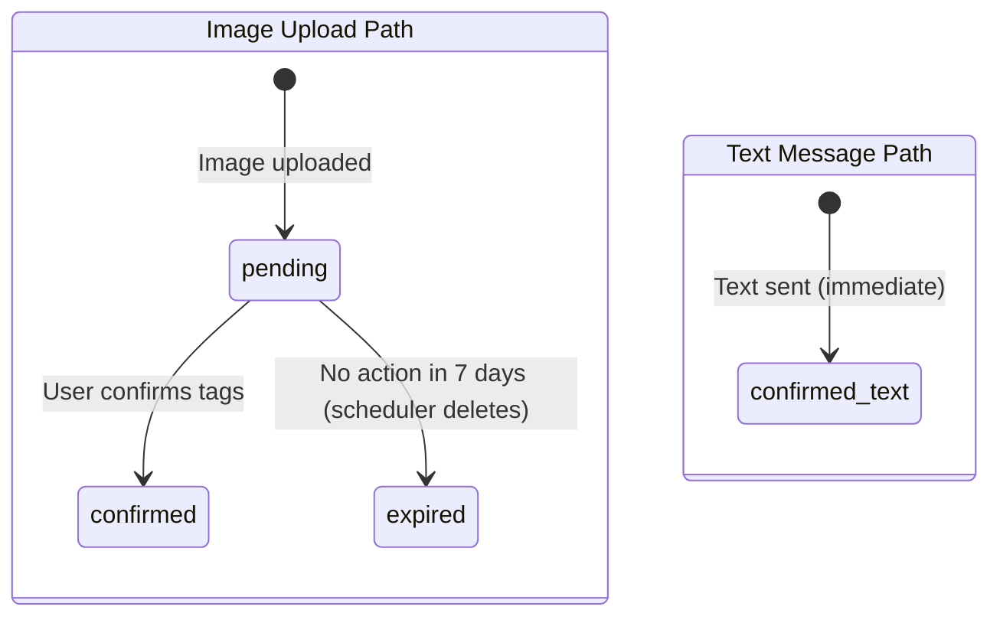

### Task State Flow

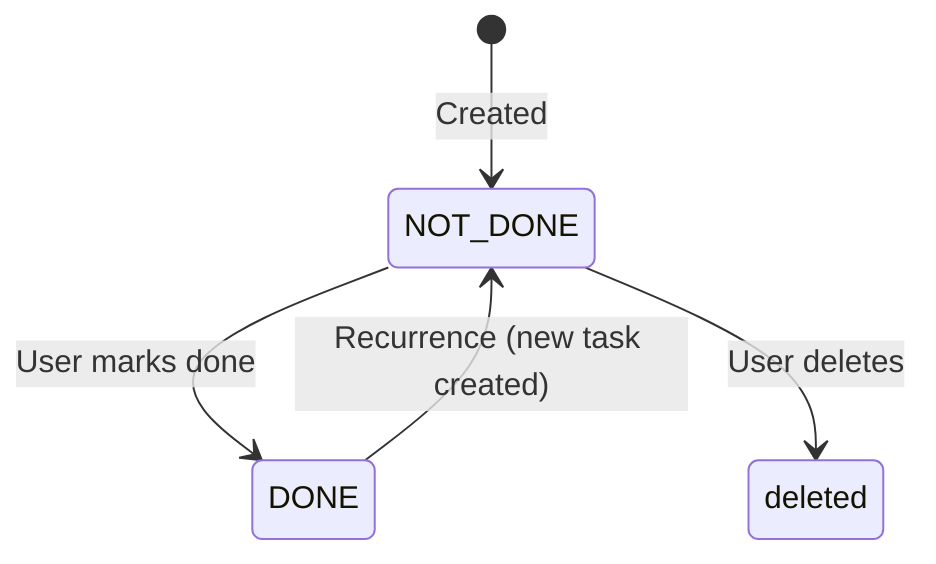

### Reminder Lifecycle

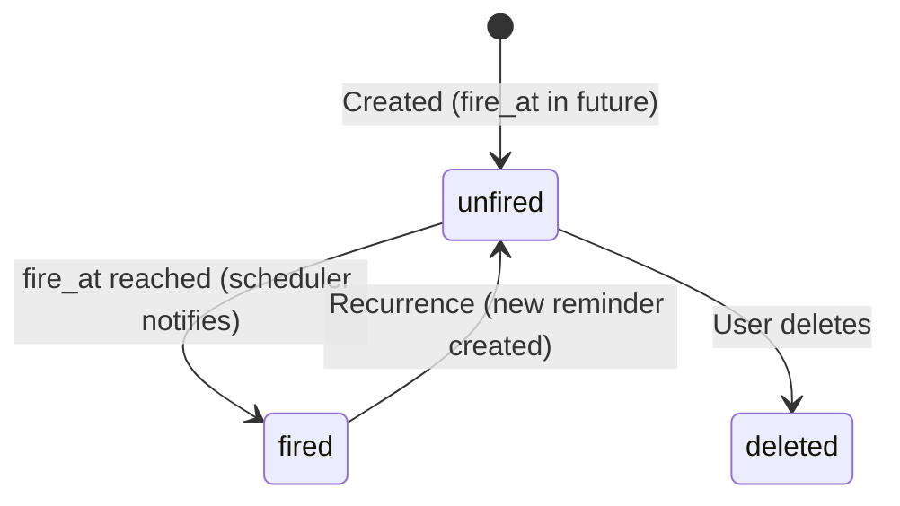

### Event Status Flow

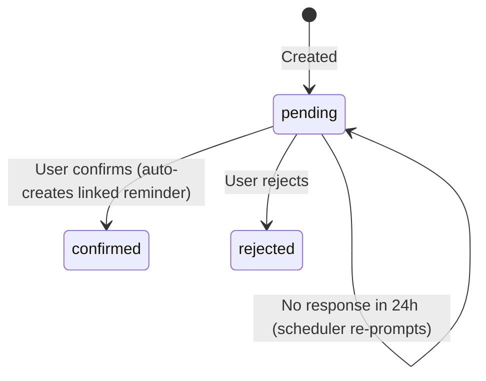

### Tag Status Flow

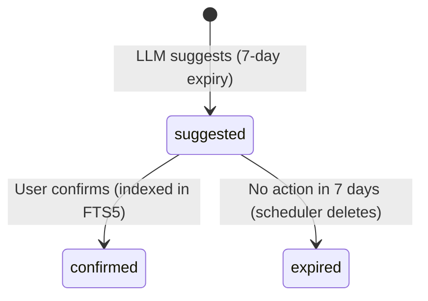

---

## Important Considerations

### Security

- **User allowlisting:** Both Telegram bots restrict access via `ALLOWED_USER_IDS` environment variable. Unauthorized users receive a rejection message.
- **No direct DB access:** Only the Core API touches SQLite. All other services communicate via HTTP.
- **Parameterized queries:** All SQL uses parameterized queries to prevent injection.
- **Tool schema isolation:** The assistant's `owner_user_id` is injected server-side into tool calls, never exposed in OpenAI tool schemas. Users cannot forge ownership.

### Reliability

- **Consumer groups:** Redis consumer groups ensure each message is processed exactly once per group. Unacknowledged messages are redelivered.
- **Independent scheduler tasks:** Each housekeeping task catches its own exceptions. A failure in reminder firing does not block memory expiry.
- **Graceful shutdown:** All services register SIGTERM/SIGINT handlers and clean up connections (close Redis, HTTP clients, cancel async tasks).
- **Restart policy:** Telegram gateway and assistant use `unless-stopped` restart policy in Docker Compose.

### Persistence

- **SQLite WAL mode:** Allows concurrent reads during writes. Single-writer model fits the single-user design.
- **Redis AOF:** Redis runs with `--appendonly yes` for durability. Data survives container restarts.
- **Docker volumes:** `db-data`, `image-data`, and `redis-data` are named volumes that persist across container rebuilds.

### Token Budget Management

The assistant service reserves tokens for three purposes:
- **Briefing:** 5,000 tokens for upcoming tasks, reminders, and session summary
- **Response:** 4,000 tokens reserved for the LLM response
- **Chat history:** Remaining budget (context window minus briefing and response reserves)

When chat history exceeds 70% of its budget, the oldest half is replaced with an LLM-generated summary. The summary is stored in Redis with a 7-day TTL and injected into the next session's briefing.

### Recurrence

Tasks and reminders support recurrence via `recurrence_minutes`. When a recurring item completes (task marked DONE, reminder fired), the system automatically creates a new instance with the next occurrence time. The original is marked as completed/fired.

### FTS5 Search

Full-text search indexes memory content and confirmed tags only. The search module:
- Filters 50+ English stop words
- Wraps each remaining term in double quotes
- Joins terms with OR
- Boosts pinned memories to the top of results
- Uses a metadata cache table (`memories_fts_meta`) for safe FTS5 deletes

---

## Infrastructure

### Docker Compose Services

| Service | Image | Port | Health Check | Depends On |
|---|---|---|---|---|
| core | `core/Dockerfile` | 8000 | `curl /health` (30s interval) | redis |
| telegram | `telegram/Dockerfile` | — | — | core, redis |
| llm-worker | `llm_worker/Dockerfile` | — | — | core, redis |
| assistant | `assistant/Dockerfile` | — | — | core, redis |
| email | `email_poller/Dockerfile` | — | — | core, redis |
| redis | `redis:7-alpine` | — | `redis-cli ping` (10s interval) | — |

### Volumes

| Volume | Purpose |
|---|---|
| `db-data` | SQLite database file (`/data/db/`) |
| `image-data` | Uploaded images (`/data/images/`), shared between core and llm-worker |
| `redis-data` | Redis AOF persistence (`/data`) |

### Redis Streams

| Stream | Producer | Consumer Group | Purpose |
|---|---|---|---|
| `llm:image_tag` | Core API | `llm-worker` | Image tagging jobs |
| `llm:intent` | Core API | `llm-worker` | Intent classification jobs |
| `llm:followup` | Core API | `llm-worker` | Follow-up question jobs |
| `llm:task_match` | Core API | `llm-worker` | Task matching jobs |
| `llm:email_extract` | Core API | `llm-worker` | Email event extraction jobs |
| `notify:telegram` | LLM Worker, Scheduler | `telegram` | Notifications to users |

### Redis Keys (Non-Stream)

| Key Pattern | TTL | Service | Purpose |
|---|---|---|---|
| `assistant:chat:{user_id}` | 24h | Assistant | Chat message history |
| `assistant:summary:{user_id}` | 7 days | Assistant | Session summary |
| `assistant:digest_sent:{user_id}:{date}` | 48h | Assistant | Digest dedup flag |
